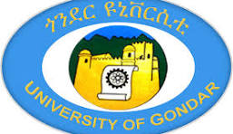
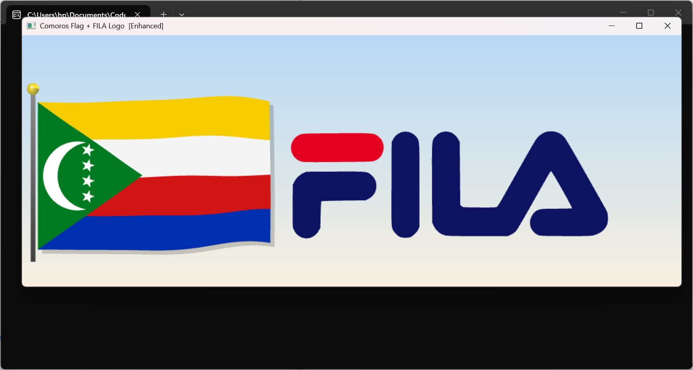

<p align="center">
  
</p>

# UNIVERSITY OF GONDAR
## Faculty of Informatics
### Department of Computer Science

**Course:** Computer Graphics (Group Assignment)  
**Project:** 🇰🇲 Comoros Flag & FILA Logo – OpenGL

---


# 🇰🇲 Description

Comoros Flag &amp; FILA Logo is an OpenGL/GLUT graphics project developed in C++. It combines an animated waving Comoros national flag with a scalable FILA logo using SVG path rendering, OpenGL tessellation, transformations, and fabric wind animation effects.

---
## 📸 Project Preview


---

## ✨ Features
- **🌊 Fabric Wave Engine:** Realistic real-time waving animation using sine/cosine physics.
- **🌙 Geometric Accuracy:** Precise rendering of the crescent moon and 4 stars using stencil buffers.
- **🎨 Custom Logo:** FILA logo rendered through SVG path parsing and GLU tessellation.


---

## 👥 The Team & Contributions
This project was a collaborative effort by Gondar University Computer Science students:

| # | Name | GitHub | Role |
|---|------|--------|------|
| 1 | **Solomon** | [@selomon127-code](https://github.com/selomon127-code) | Globals, Constants & State Management |
| 2 | **Tesfaye** | [@tesfaye263](https://github.com/tesfaye263) | SVG-to-GL Mapping & Bezier Curves |
| 3 | **Fanuel** | [@Fanuelayana6](https://github.com/Fanuelayana6) | SVG Path Parser & GLU Tessellation |
| 4 | **Asrat** | [@Asr27-dott](https://github.com/Asr27-dott) | FILA Logo Data & Path Definitions |
| 5 | **Melaku** | [@Melaku01](https://github.com/Melaku01) | Physics Wave Engine, Pole & Shadows |
| 6 | **Nicolas** | [@17nicolas-be](https://github.com/17nicolas-be) | Flag Symbols, Triangle & Background |


---

## 🛠️ Tech Stack
- **Language:** C++14
- **Graphics API:** OpenGL
- **Utility Toolkit:** GLUT / FreeGLUT
- **Mathematics:** Standard Math Library (`cmath`)

---
## 🎮 Interaction Controls
- **'R' / 'r'**: Rotate the flag view.
- **'S' / 's'**: Scale (Zoom in/out).
- **'+' / '-'**: Increase/Decrease wind speed for the waving animation.
- **Arrow Keys**: Move the flag position (X and Y axis).
- **'ESC'**: Exit the application.
- 

 ## 📐 Technical Implementation
- **Primitives**: Used `GL_TRIANGLES`, `GL_QUADS`, and `GL_POLYGON` for flag and logo geometry.
- **Transformations**: Implemented `glRotatef`, `glScalef`, and `glTranslatef` for interactivity.
- **Animation**: Real-time wave effect using a Sine wave function: `y = A * sin(kx - wt)`.
- **Tessellation**: Applied custom polygon tessellation for the FILA logo characters.

## 🔍 Source Code Access
The complete implementation can be found in:
👉 **[main.cpp](./main.cpp)** 
*(Contains: Window setup, Wave logic, Logo tessellation, and Input handling)*

## ▶️ How to Run

## 🖥️ Windows Setup & Run

### 1. Prerequisites
Before running the project, install:

- Code::Blocks IDE (with MinGW compiler)
- FreeGLUT library for OpenGL rendering

---

### 2. Download Project

Open CMD or PowerShell:

```bash
git clone https://github.com/selomon127-code/Comoros-FILA-OpenGL.git

...
cd Comoros-FILA-OpenGL
``` 

### 🐧 Linux / macOS
```bash
g++ -std=c++14 main.cpp -lGL -lGLU -lglut -o comoros_fila
./comoros_fila
